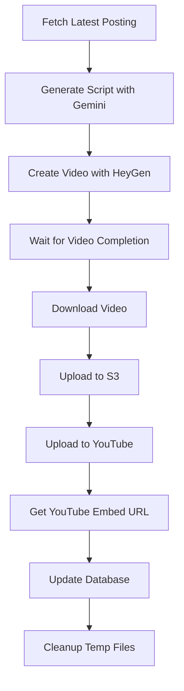

# 🎥 AI Video Generator - Complete Solution

## 📋 Overview
This comprehensive solution automates the entire process of creating AI videos from database content:

1. **Fetch Latest Posting** - Retrieves newest posting without video URL
2. **Generate Script** - Uses Google Gemini AI to create natural video script
3. **Create AI Video** - Generates video using HeyGen API with Korean voice
4. **Upload to S3** - Stores video in AWS S3 bucket
5. **Publish to YouTube** - Uploads to YouTube channel and gets embed URL
6. **Update Database** - Saves all URLs and metadata back to database

## 🗂️ File Structure
```
container-video-generator/
├── ai-api.py              # Main script with all functionality
├── requirements.txt       # Python dependencies
├── setup.py              # Setup helper script
├── test_components.py    # Component testing script
├── database_schema.sql   # Database structure
├── README.md            # Detailed setup guide
├── .env.example         # Environment variables template
├── .env                 # Your actual environment variables (created by setup)
├── client_secret_template.json # YouTube API template
├── venv/                # Python virtual environment
└── (generated files during runtime)
```

## 🚀 Quick Start

1. **Setup Environment**
   ```bash
   source venv/bin/activate
   python setup.py
   ```

2. **Configure APIs**
   - Fill in `.env` with your API keys
   - Set up `client_secret.json` for YouTube
   - Create database using `database_schema.sql`

3. **Test Components**
   ```bash
   python test_components.py
   ```

4. **Run Full Workflow**
   ```bash
   python ai-api.py --workflow
   ```

## 🔧 Configuration

### Required API Keys
- **HeyGen API**: For AI video generation
- **Gemini API**: For script generation
- **AWS Credentials**: For S3 storage
- **YouTube Data API**: For video publishing

### Database Requirements
- MySQL/MariaDB database
- Table with columns: `id`, `title`, `content`, `video_url`, `youtube_embed_url`

## 📊 Workflow Process



## 🎯 Key Features

- **Automated Content Pipeline**: Complete hands-off operation
- **Error Handling**: Comprehensive error checking at each step
- **Status Monitoring**: Real-time progress updates
- **Flexible Configuration**: Easy to customize for different use cases
- **Bilingual Support**: Korean voice with English/Korean script generation
- **Multiple Storage**: Both S3 and YouTube for redundancy
- **Database Integration**: Updates existing records with video URLs

## 🔄 Usage Modes

### 1. Full Workflow (Recommended)
```bash
python ai-api.py --workflow
```
Runs the complete automated pipeline.

### 2. Single Video Generation (Original)
```bash
python ai-api.py
```  
Generates video with predefined script (for testing).

### 3. Component Testing
```bash
python test_components.py        # Test all components
python test_components.py gemini # Test specific component
```

## ⚙️ Customization Options

### Video Settings
- Avatar selection (current: Annie_expressive12_public)
- Voice selection (current: Korean voice)
- Video dimensions (current: 1280x720)
- Background video asset

### Script Generation
- Modify prompt in `generate_script_with_gemini()`
- Adjust script length and tone
- Change language or style preferences

### Database Schema
- Adapt queries in `fetch_latest_posting_without_video()`
- Modify update logic in `update_posting_with_video_urls()`

## 🛡️ Error Handling

The system includes robust error handling for:
- API failures and rate limits
- Network connectivity issues
- File upload/download problems
- Database connection errors
- Authentication failures

## 📈 Monitoring & Logs

All operations include detailed console output with:
- ✅ Success indicators
- ❌ Error messages
- ⏳ Progress updates
- 📊 Status summaries

## 🔐 Security Considerations

- Environment variables for sensitive data
- OAuth2 flow for YouTube authentication
- Secure credential storage
- No hardcoded API keys in source code

## 🚨 Important Notes

1. **First YouTube Upload**: Requires interactive OAuth authentication
2. **Video Generation Time**: Can take 5-10 minutes per video
3. **API Rate Limits**: Respect limits for all services
4. **Storage Costs**: Monitor S3 and YouTube usage
5. **Database Permissions**: Ensure read/write access to postings table

## 🆘 Troubleshooting

### Common Issues
- **"ModuleNotFoundError"**: Run `pip install -r requirements.txt`
- **"Database connection failed"**: Check DB credentials in `.env`
- **"API key invalid"**: Verify all API keys are correctly set
- **"OAuth2 error"**: Ensure `client_secret.json` is properly configured

### Getting Help
1. Run component tests to isolate issues
2. Check console output for specific error messages
3. Verify all configuration files are properly set up
4. Ensure all API services are enabled and have sufficient quotas

---

🎉 **Ready to generate AI videos automatically!** 

Run `python ai-api.py --workflow` to start your first automated video generation.
